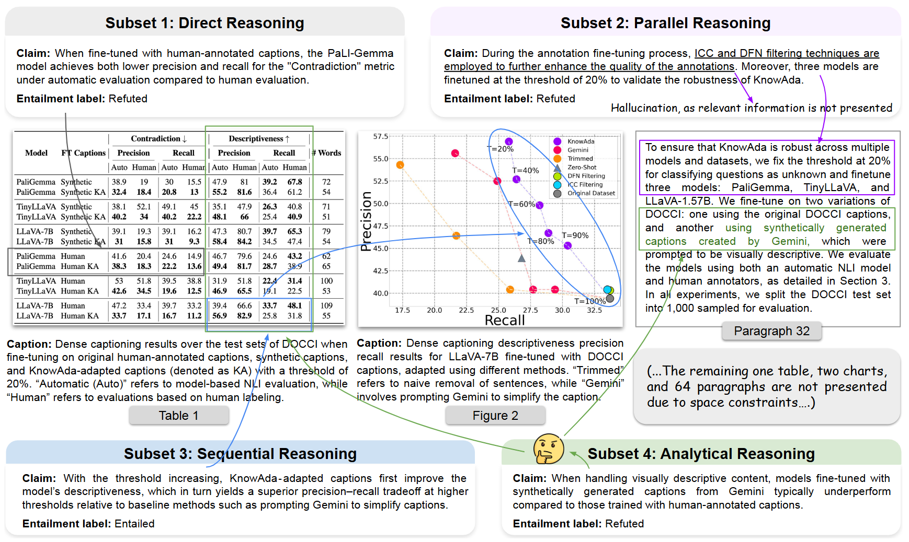

# SCIVER: A Benchmark for Multimodal Scientific Claim Verification

<p align="center">
  <a href="https://github.com/QDRhhhh/SciVer">🌐 Github</a> •
  <a href="">📖 Paper</a> •
  <a href="https://huggingface.co/datasets/chengyewang/SciVer">🤗 Data</a>
</p>

## 📰 News
- [May 15, 2025] SciVer has been accepted by ACL 2025 Main!

## 👋 Overview



**SCIVER** is the first benchmark specifically designed to evaluate the ability of foundation models to verify scientific claims across **text**, **charts**, and **tables**. It challenges models to reason over complex, multimodal contexts with **fine-grained entailment labels** and **expert-annotated rationales**.

> 📌 “Can Multimodal Foundation Models Reason Over Scientific Claims with Text, Tables, and Charts?”

------

## 🌟 Highlights

- 🧪 **3,000 expert-annotated examples** from **1113 scientific papers**
- 🧠 Four core **reasoning subsets**:
  - Direct
  - Parallel
  - Sequential
  - Analytical
- 📚 Context includes **text paragraphs, multiple tables, and charts**
- 🔍 Labels: `Entailed`, `Refuted`
- 📈 Evaluated across **21 leading foundation models**, including GPT-4o, Gemini, Claude 3.5, Qwen2.5-VL, LLaMA-3.2-Vision, etc.
- ⚖️ Includes **step-by-step rationale** and **automated accuracy evaluation**

------

## 🧩 Benchmark Structure

Each SCIVER sample includes:

- A **claim** grounded in multimodal scientific context
- **Contextual inputs**: text, tables (as images), charts (as images)
- A **gold entailment label** (entailed / refuted)
- **Supporting evidence** and a **reasoning rationale**

### 🧠 Subsets by Reasoning Type

1. **Direct Reasoning** – extract simple facts
2. **Parallel Reasoning** – synthesize info from multiple sources
3. **Sequential Reasoning** – perform step-by-step inference
4. **Analytical Reasoning** – apply domain expertise and logic

------

## 📊 Model Evaluation

We evaluate 21 models using Chain-of-Thought prompting.

| Model            | Accuracy  |
| ---------------- | --------- |
| 🧑‍🔬Human Expert   | **93.8%** |
| o4-mini (OpenAI) | 77.7%     |
| GPT-4o           | 70.9%     |
| Qwen2.5-VL-72B   | 69.4%     |
| InternVL3-38B    | 62.5%     |

> Text-only versions of models drop 35–53% in accuracy — showing **multimodal context is essential**.

------

## 🛠️ Quickstart

### 🔁 Step 0: Installation

```bash
git clone https://github.com/QDRhhhh/SciVer.git
cd SciVer
conda create --name sciver python=3.10
conda activate sciver
pip install -r requirements.txt
```

### 🔁 Step 1: Download Dataset from huggingface

```bash
git lfs install
git clone https://huggingface.co/datasets/chengyewang/SciVer
```

### 🔁 Step 2: Run Model Inference

```bash
bash scripts/vllm_large.sh
```

This will generate model responses and save them to:

```
./outputs/
```

### ✅ Step 3: Evaluate Model Accuracy

```bash
python acc_evaluation.py
```

The processed results and accuracy scores will be saved to:

```
./processed_outputs/
```

------

## 🤝 Contributing

We welcome contributions for:

- 🧬 Domain extension (e.g., biology, medicine)
- 🔧 Additional model adapters
- 📈 New evaluation metrics and visualization tools